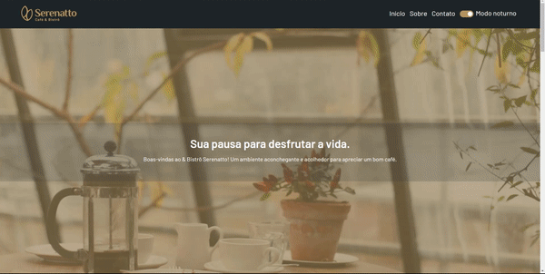

# Serenatto Coffee Shop Landing Page

Welcome to the Serenatto Coffee Shop Landing Page! This project is designed to showcase the services, products, and unique features of Serenatto Coffee Shop. Whether you're a coffee enthusiast or looking to explore the world of coffee, Serenatto has something special to offer.

## Landing Page

## Introduction

Serenatto Coffee Shop is a cozy coffee shop that aims to provide an exceptional coffee experience to its customers. This landing page is designed to introduce visitors to Serenatto and highlight the services and products available.

## Features

### 1. Services

Serenatto Coffee Shop offers the following services:

- **Buffet**: Enjoy a delightful buffet experience with a wide range of coffee blends, pastries, and snacks.

- **Delivery**: Can't visit us in person? No problem! Serenatto offers convenient delivery services, bringing your favorite coffee and treats right to your doorstep.

- **Bistro**: Our bistro offers a wide variety of coffees, smoothies, delicious snacks and desserts. An excellent option for those looking for a quiet and cozy place.

### 2. Products

Explore our high-quality coffee products, including:

- A variety of coffee beans from different regions
- Specialty coffee blends
- Freshly baked pastries
- Signature coffee drinks
- Smoothies and vitamins
- Cakes and pastry

### 3. Contact Form

We value your feedback and inquiries. The landing page features a contact form that allows visitors to get in touch with us easily. Feel free to reach out with any questions or comments.

### 4. Dark Mode

Enjoy browsing the Serenatto Coffee Shop landing page in style with our dark mode feature. Users can switch between light and dark themes to suit their preferences.

### 5. Responsive Design

Our website is designed to provide an optimal viewing experience across a range of devices, including tablets, mobile phones, and desktops. No matter how you access the site, you'll have a seamless experience.
